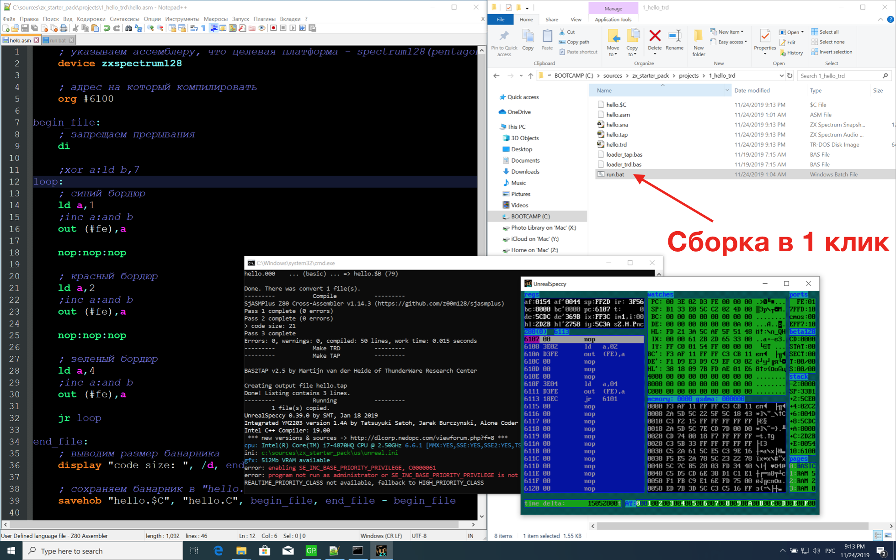

# zx starter pack
## Стартовый набор для вхождения в разработку под ZX Spectrum

В архиве содержится уже настроенная среда, для разработки под **ZX Spectrum**.

Последняя версия **zx starter pack**, а также место для **issue** и **pullrequest**: 
https://github.com/errorcalc/zx_starter_pack
